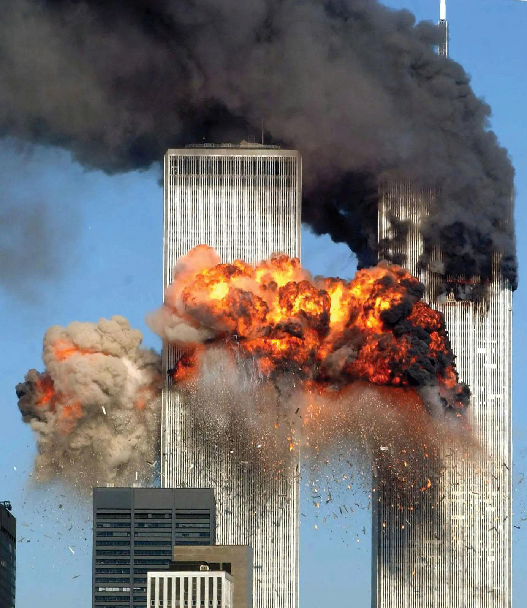
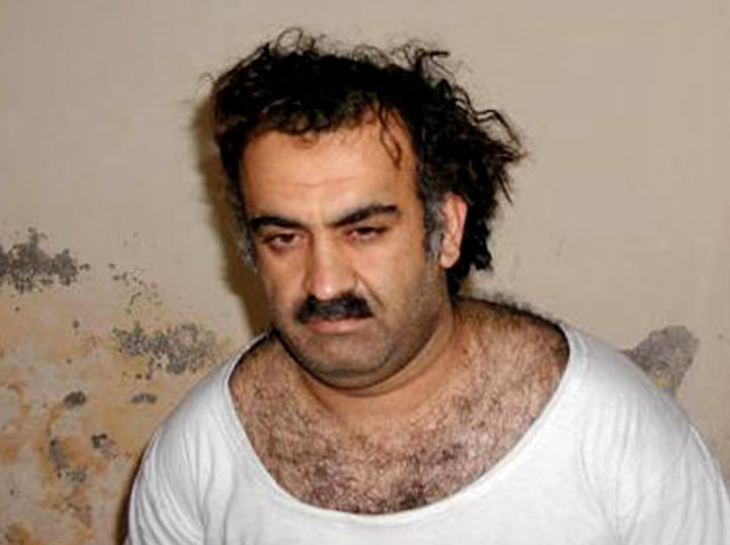
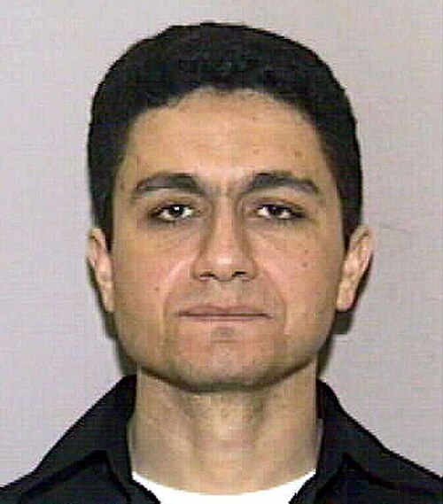
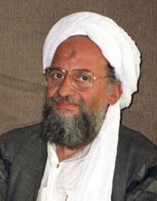

<!DOCTYPE html>
<html lang="en">
<head>
    <meta charset="UTF-8">
    <meta name="viewport" content="width=device-width, initial-scale=1.0">
    <title>INTERPOL</title>
</head>

<body>
    

    <h1>INTERPOL</h1>
    
Welcome to INTERPOL!

    
October 7, 2026

    
The INTERPOL app, available on platforms supporting Android, macOS, and iOS, enables quick access to critical information from global authorities regarding complex developments and the multifaceted evolution of the modern world.

    

    

    
United Nations forces are currently collaborating with agencies worldwide to track down the remaining terrorist cells linked to Osama bin Laden, the leader of the international terrorist organization Al-Qaeda.

    
    
He is best known for founding and leading the terrorist organization Al-Qaeda and for orchestrating the September 11, 2001, terrorist attacks in the United States—involving the hijacking of planes that crashed into the Twin Towers of the World Trade Center in New York and the Pentagon—which killed nearly 3,000 people. Additionally, he was responsible for or behind numerous other notorious bombings targeting U.S. and Western interests worldwide throughout the 1990s and 2000s.

    
    
He is also known for establishing multiple cyberattack groups that stole information from various organizations and governments.
    Currently, these groups are known to operate covertly, keeping the organization's illicit activities under wraps.

    

    

       
Khalid Sheikh Mohammed: The man considered the mastermind who devised the detailed plan for the entire attack operation (known as the "Plane Operation") and personally presented the concept to Osama bin Laden.

       
    

    

       
Mohammed Atta: The ringleader of the hijackers and the pilot who flew the first plane that crashed into the Twin Towers (American Airlines Flight 11).

       
    

    

       
Ramzi bin al-Shibh: A key intermediary who facilitated the transfer of funds and communications between the hijackers in the United States and Al-Qaeda's high command in Afghanistan.

       
    

    

       
Ayman al-Zawahiri: Osama bin Laden's closest deputy and Al-Qaeda's strategic ideologue (who later became the organization's leader after Bin Laden was killed).

       
    

    

    
Recent drafts indicate a complex situation arising from the actions of his followers and the lingering repercussions of his past conduct; these factors have negatively influenced the mindset of some young people worldwide, drawing them toward an ideology that the United Nations classifies as extremist.

    
Notably, INTERPOL has identified dark web sites closely linked to extremist terrorist elements backed by splinter groups formed following the dissolution of earlier organizations—specifically MIDDO-Z, NHT-7648, and HUDoop. While the precise activities and exact membership numbers of these groups remain unknown, INTERPOL has pinpointed the specific regional codes associated with each group across Asia and the Americas.

    

    
Individuals should take the initiative to avoid accessing suspicious links (especially those originating from the aforementioned groups). Do not actively seek out these organizations in any form. Proactively steer clear of extremist ideologies (such as crimes against humanity).

    

    
- Subject 1 is tentatively identified as Nguyen Huu Tai, a Vietnamese national residing in An Giang Province (Southern Vietnam); his location and browser login details were determined via area code and an IP address (***) belonging to the Viettel network, accessed using the Tor browser.

    
- The second subject has been preliminarily identified as Adriana, a Mexican national residing in the city of Oaxaca; her location and login details were traced via I2P, revealing various aliases such as "marrilue" and "Adrona." While she is known to have close ties and shares a Wi-Fi IP address with others, her specific physical location could not be pinpointed.

    

    
CANADA, VIET NAM, MEXICO, CHINA, INDIA, AMERICA, FPI, INTERPOL 

</body>
</html>
